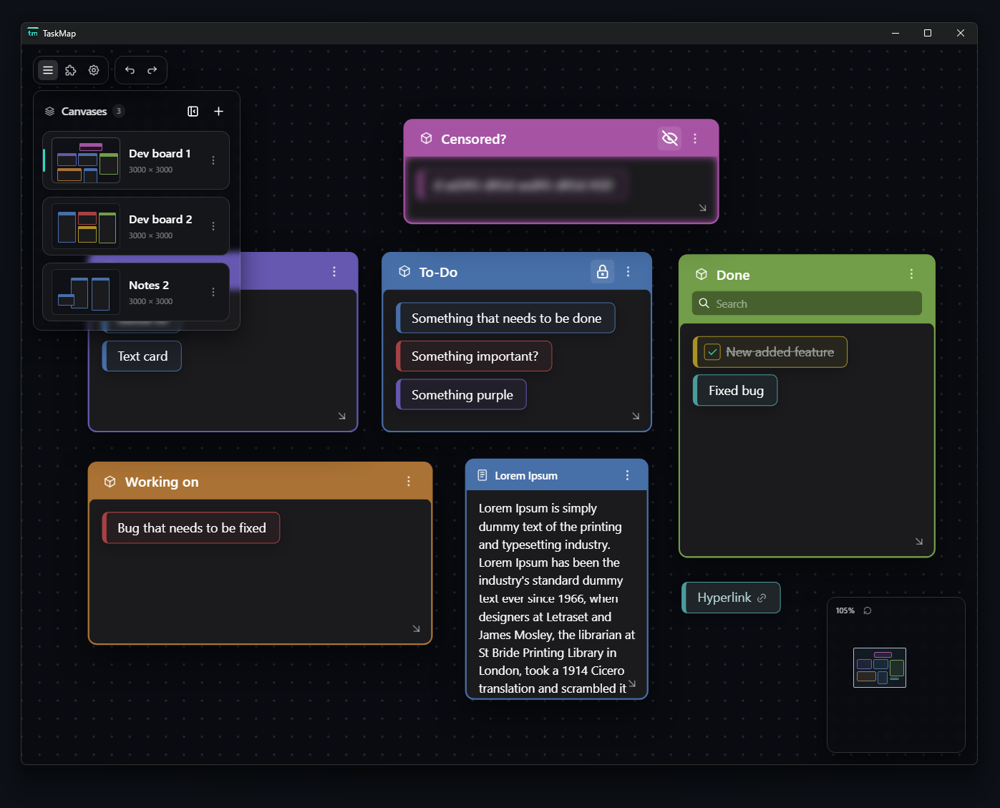

# TaskMap

TaskMap is a dark-mode desktop canvas for visually organizing tasks, notes, and ideas.
Arrange containers, text, and images across multiple zoomable workspaces while keeping
your project data stored locally.
